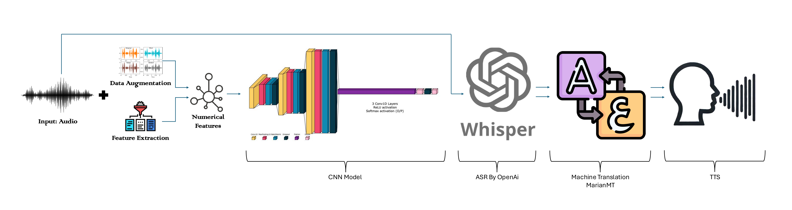
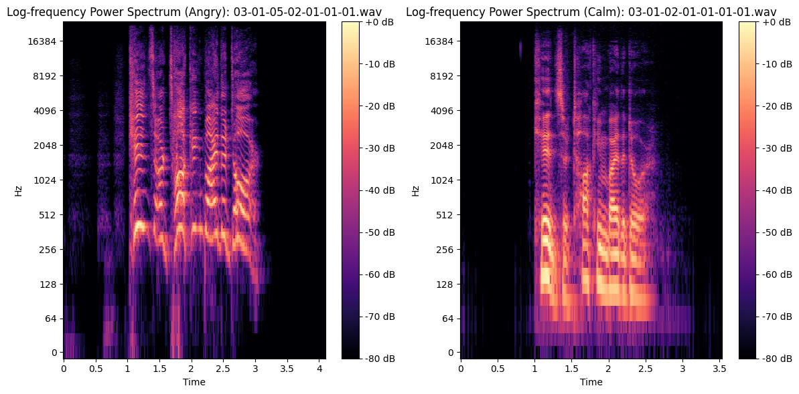
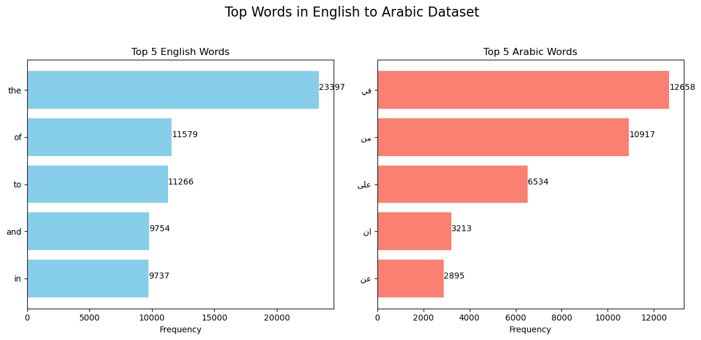
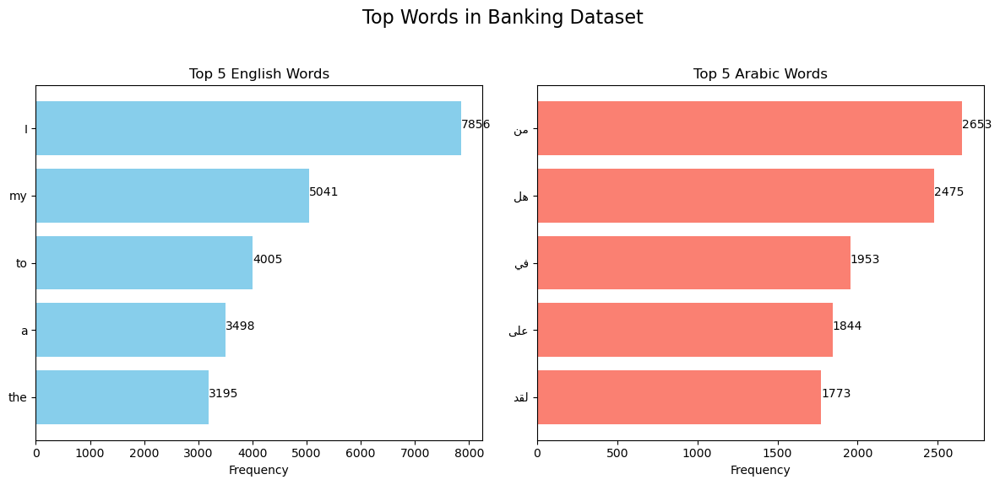

# Emotion-Driven Speech Transcription and Cross-Lingual Translation with Arabic TTS Integration

This repository contains the implementation of a multilingual and emotion-driven system designed to enhance customer service interactions in the banking domain. The system integrates **Speech Emotion Recognition (SER)**, **Automatic Speech Recognition (ASR)**, **Machine Translation (MT)**, and **Text-to-Speech (TTS)**, enabling emotion-preserving, cross-lingual communication.

---

## Background

Effective communication across languages and emotions is critical, especially in customer service industries like banking. Language barriers and the inability to recognize customer emotions can hinder the resolution of issues. This project bridges these gaps by creating an end-to-end system that:
- Recognizes emotions in speech.
- Transcribes speech to text.
- Translates text across languages.
- Synthesizes speech—all while retaining emotional nuances.

---

## Architectures

The system employs the following models:
- **Speech Emotion Recognition (SER):**
  - Convolutional Neural Network (CNN) model for recognizing emotions from audio signals.
  - Incorporates data augmentation and feature extraction techniques like MFCCs and ZCR for improved performance.
- **Automatic Speech Recognition (ASR):**
  - **Whisper** by OpenAI, a transformer-based model for robust English transcription.
- **Machine Translation (MT):**
  - **MarianMT**, a fine-tuned, pre-trained transformer-based model for English-to-Arabic translation.
- **Text-to-Speech (TTS):**
  - **MMS-TTS-Ara**, a model for generating natural Arabic speech while retaining emotional tones.

Figure 1: System Architecture

---
## Exploratory Data Analysis

Figure 2: Log-Frequency Power Spectrum of Different Emotions

Figure 3: Top words in English-Arabic Datset

Figure 4: top words in banking Dataset

Figure 5: Average sentence length comparison Translation

## Repository Structure

### Folder Details

#### 1. **`Automatic Speech Recognition (Whisper)`**
   - Contains scripts and configurations for **OpenAI’s Whisper** model.
   - Used for automatic speech recognition to transcribe English audio into text.
   - Includes:
     - Whisper configuration files.
     - Preprocessing scripts for audio input.
     - Example usage scripts for Whisper ASR.

#### 2. **`Machine Translation`**
   - Responsible for the machine translation tasks in the pipeline, specifically **English-to-Arabic translation**.
   - **Subfolders:**
     - **`Best Model/`:**
       - Compressed pre-trained and fine-tuned MarianMT model files for translation tasks.
     - **`Dataset for Translation/`:**
       - Stores datasets used for fine-tuning the MarianMT model, including English-Arabic parallel sentences.
     - **`Machine Translation/MachineTranslation_Using_Transformers_Low_Score.ipynb`:**
       - Contain the script of the Model that is based on transformers that is creatsed from scratch.
     - **`Machine Translation/Machine Translation/Machine_Translation_MarianMT_BestModel.ipynb`:**
       - Contain the script of MarianMT the fine tuned model .
     - **`Human Evaluation/`:**
       - Contain the Human evaluation that is done on the best model.

#### 3. **`Speech Emotion Recognition`**
   - Manages emotion recognition tasks using **CNN-based models**.
   - **Subfolders:**
     - **`RAVDESS Dataset/`:**
       - Raw audio files and their preprocessed versions (e.g., augmented data).
       - Contains labeled datasets like RAVDESS for emotion classification.
     - **`Full Code/`:**
       - Training scripts and configurations for the CNN model used in Speech Emotion Recognition (SER).
       - Includes hyperparameter tuning and augmentation techniques.

#### 4. **`TTS` (Text-to-Speech)**
   - Responsible for converting translated Arabic text into natural speech using **MMS-TTS-Ara**.
   - **Subfolders:**
     - **`TTS/TTS.ipynb`:**
       - Pre-trained MMS-TTS-Ara model script.

### Additional Notes
- **Compressed Models:** Compressed model files under `Marian_MT_Best_Model_compressed/` are designed for users to download and uncompress before using them in translation tasks.
- **Training Data and Fine-Tuning:** Each component (SER, MT, ASR, TTS) has its own scripts for fine-tuning and training, allowing modular customization for different domains or languages.

## Installation

To set up the project, follow the steps below:

### 1. Clone the Repository
First, clone the repository to your local machine:
git clone https://github.com/besherhasan/Emotion-Driven-Speech-Transcription-and-Cross-Lingual-Translation-with-Arabic-TTS-Integration.git
cd Emotion-Driven-Speech-Transcription-and-Cross-Lingual-Translation-with-Arabic-TTS-Integration

### Install dependencies:

#### Install the required Python libraries using pip:
##### pip install -r requirements.txt

#### Install GPU-optimized PyTorch (if applicable):

##### pip install torch torchvision torchaudio --index-url https://download.pytorch.org/whl/cu118

## Training
### Model Weights
#### Download the pre-trained and fine-tuned model weights:

##### Marian MT Best Model in :    - **`Best Model/`:**

##### SER CNN Model

Place the downloaded weights in the appropriate directories under /weights/.

## Methodology
The pipeline follows these steps:

Emotion Detection (SER): Analyzes the customer's voice to detect emotional tone using a CNN.
Speech Transcription (ASR): Converts English speech to text using Whisper.
Text Translation (MT): Translates English text to Arabic using fine-tuned MarianMT.
Speech Synthesis (TTS): Converts translated Arabic text to speech using MMS-TTS-Ara.
Contributions

## This project introduces:

A multilingual pipeline preserving emotional context in speech translation.
Fine-tuned MarianMT for domain-specific English-Arabic translations.
Integration of SER, ASR, MT, and TTS into a seamless system.
Practical applications in the banking domain to improve customer service experience.

## Contribution
Our project introduces an innovative integration of emotion-driven speech transcription and cross-lingual translation, tailored specifically for the banking customer service domain. Unlike traditional systems, we prioritize the retention of emotional context throughout the communication pipeline, ensuring empathetic and effective service delivery. By leveraging state-of-the-art models such as a CNN for Speech Emotion Recognition (SER), Whisper for Automatic Speech Recognition (ASR), fine-tuned MarianMT for machine translation, and MMS-TTS-Ara for Arabic Text-to-Speech (TTS), we deliver a seamless end-to-end multilingual solution. Key contributions include:

Preserving emotional nuances during translation to enhance client engagement.
Achieving high translation accuracy (BLEU score of 56 and BERTScore F1 of 88.7%) and robust emotion detection (F1-score of 94%).
Demonstrating practical applications in the banking sector, addressing language and emotional barriers to improve customer satisfaction and responsiveness.
This work bridges linguistic and emotional gaps in automated systems, presenting a transformative solution for customer service.

## Challenges
Limited Data: Domain-specific datasets for fine-tuning were limited, affecting performance.
Hardware Constraints: Training and inference required high computational power.
Integration: Combining SER, ASR, MT, and TTS demanded significant preprocessing and optimization.

## Future Directions
Dataset Expansion: Incorporate larger, diverse datasets for better performance.
Advanced Fine-Tuning: Explore techniques like LoRA or adapter layers for efficient domain adaptation.
Real-Time Processing: Optimize the system for real-time emotion-driven translation.
Additional Languages: Extend the pipeline to support more languages.

